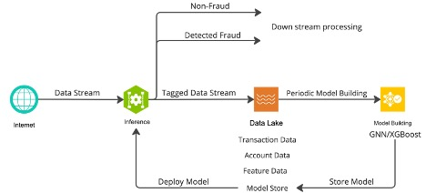
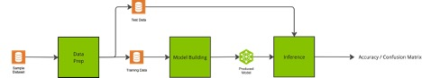

# High-Level Architecture
The general fraud architecture, as depicted below at a very high-level, uses
Morpheus to continually inspect and classify all incoming data. What is not
shown in the diagram is what a customer should do if fraud is detected, the
architecture simply shows tagged data being sent to downstream processing.
Those processes should be well defined in the customers’ organization.
Additionally, the post-detected data, what we are calling the Tagged Data
Stream, should be stored in a database or data lake.  Cleaning and preparing
the data could be done using Spark RAPIDS. 

Fraud attacks are continually evolving and therefore it is important to always
be using the latest model. That requires the model(s) to be updated often as
possible. Therefore, the diagram depicts a loop where the GNN Model Building
process is run periodically, the frequency of which is dependent on model
training latency. Given how dynamic this industry is with evolving fraud
trends, institutions who train models adaptively on a frequent basis tend to
have better fraud prevention KPIs as compared to their competitors.

 

  

 

# This Workflow
The above architecture would be typical within a larger financial system where incoming data run through the inference engine first and then periodically a new model build. However, for this example, the workflow is will start with model building and end with Inference. The workflow is depicted below:

 

  

 

 1.	__Data Prep__: the sample dataset is cleaned and prepared, using tools like NVIDIA RAPIDS for efficiency. Data preparation and feature engineering has a significant impact on the performance of model produced. See the section of data preparation for the step we did get the best results
    - Input: The sample dataset
    - Output: Two files; (1) a data set for training the model and a (2) dataset to be used for inference.

2. __Model Building__: this process takes the training data and feeds it into cugraph-pyg for GNN training. However, rather than having the GNN produce a model, the last layer of the GNN is extracted as embeddings and feed into XGBoost for production of a model.
    - Input: Training data file
    - Output: an XGBoost model and GNN model that encodes the data

3. __Inference__: The test dataset, extracted from the sample dataset, is feed into the Inference engine. The output is a confusion matrix showing the number of detected fraud, number of missed fraud, and number of misidentified fraud (false positives).

 

[<-- Top](../README.md)  
[<-- Back: Background](./background.md)  
[--> Next: Datasets](./datasets.md)
